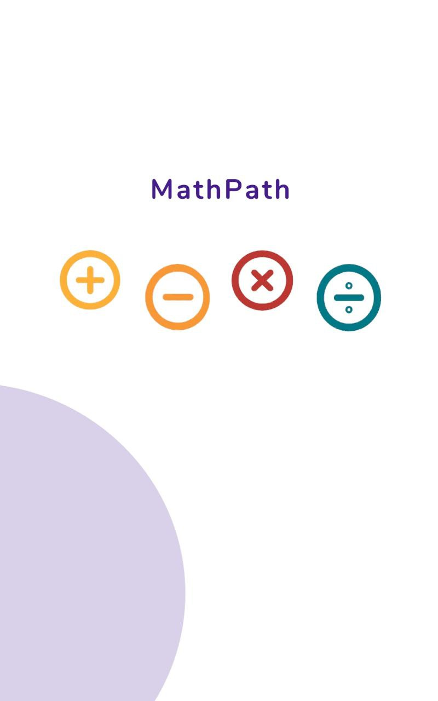
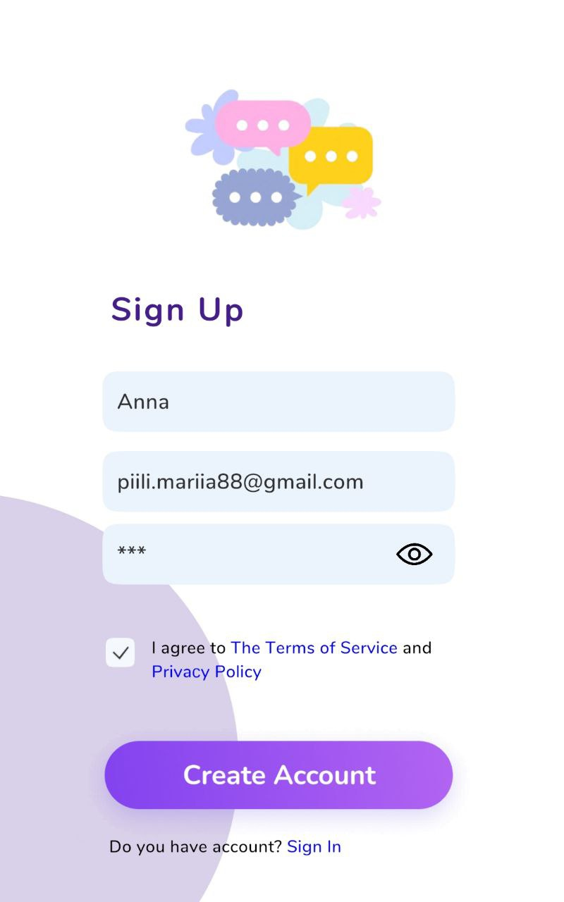

# MathPath application

A simple and engaging application built with Unity and C# to help children enhance their mathematical skills through interactive learning. The app provides a modern and intuitive design, progress tracking, and real-time updates for parents.

## Key Features

### User-Friendly Interface (UI):
- Clear and intuitive design tailored for children.
- Developed with Figma prototypes and implemented in Unity.
  
### First-Level Tasks:

- Engaging mathematical exercises stored dynamically in JSON format.
- Easy to manage and extend task structures.

### Progress Tracking:

- Tracks user progress, including correct and incorrect answers.
- Saves progress locally using PlayerPrefs.
- Displays progress visually with a dynamic progress bar and motivational feedback messages.

### Email Notifications:

- Automatically sends a detailed progress report to parents using the SendGrid API.
- Includes customizable messages with user-specific progress updates.

### Interactive Animations:

- Smooth loading animations and confetti effects upon level completion.
- Designed with Unity's animation tools for seamless transitions.
  
### Level System:

- Currently, the first level is fully implemented, with tasks read from a JSON file.
- Preparations for additional levels are in place, enabling the app to extend functionality easily by introducing new JSON files for each level.
- Future levels can introduce more challenging tasks and new features to enhance the learning experience.

## Core Mechanics

1. Registration and Authorization
The app allows users to register and log in with the following key features:

- Registration:
  - Input fields for username, email, and password.
  - Validation:
    - Username must have at least 4 characters and contain only letters.
    - Email must include the @ symbol.
    - Password must include letters, digits, and special symbols.
  - Data is securely saved using PlayerPrefs.
    
- Authorization:
  - Compares input data with saved credentials.
  - On success, triggers an event for successful login.
 
```csharp
public class AccountManager : MonoBehaviour
{
  public void Registration()
  {
      _userName = _userNameReg.text;
      _userEmail = _userEmailReg.text;
      _userPassword = _userPasswordReg.text;
      Save();
  }

  public void Authorization()
  {
      if (_userName == _userNameAuth.text && _userPassword == _userPasswordAuth.text)
      {
          IsAuthorized.Invoke();
      }
  }
}
```

2. Task Generation
   
- Tasks are dynamically loaded from JSON files for the current level.
  
- A random task is displayed, and upon user submission, the answer is validated:
   - Correct Answer: Displays a success message and increases the progress count.
   - Incorrect Answer: Displays an error message and records the mistake.
     
- At the end of the level, the progress is saved, and the user is moved to the results screen.

```csharp
public class AssignmentGenerator : MonoBehaviour
{
   public void Check()
    {
      if (_count < 9)
      {
          if (_inputFieldForAnswer.text == _currentAssignment.Answer)
          {
              _winTimer = 0;
              _progress.CorectedAnswersIncrease();

          }
          else
          {
              _lostTimer = 0;
              _progress.InCorectedAnswersIncrease();
          }

          _timer = 0f;
          _inputFieldForAnswer.gameObject.SetActive(false);
          _generation = true;
          _count++;
      }
      else
      {
          _count = 0f;
          _eventLevelCompleted.Invoke();//Переход к сранице с результатом
          PlayerPrefs.SetInt("level", 2);
          _progress.ProgressCoalcilate();
          _inputFieldForAnswer.text = "";        
          _firstTry = true;
      }
  }
}
```

3. Progress Tracking
   
- Tracks correct and incorrect answers.
  
- Displays motivational feedback based on performance:
   - "Awesome!" for excellent results.
   - "Good effort!" for intermediate results.
   - "Keep going!" for lower scores.
     
- Saves progress locally using PlayerPrefs and sends progress reports to parents.

  ```csharp
  public class Progress : MonoBehaviour
  {  
    public void ProgressCoalcilate(bool calculate = true)
    {
        _progressResilt.text = $"{_correctedAnswers}/{_totalAnswers}";
        _progressBar.fillAmount = _correctedAnswers * 1.0f / _totalAnswers;
        if (_correctedAnswers > 7)
        {
            _progressHeading.text = _headingAwesome;
            _progressDescription.text = _descriptionAwesome.Replace("\\n", "\n"); ;
            _progressBar.color = _colorGreat;
            _progressHeading.color = _colorGreat;
        }
        else if (_correctedAnswers > 4 && _correctedAnswers <= 7)
        {
            _progressHeading.text = _headingGood;
            _progressDescription.text = _descriptionGood.Replace("\\n", "\n"); ;
            _progressBar.color = _colorGood;
            _progressHeading.color = _colorGood;
        }
        else
        {
            _progressHeading.text = _headingKeepGoing;
            _progressDescription.text = _descriptionKeepGoing.Replace("\\n", "\n");
            _progressBar.color = _colorBad;
            _progressHeading.color = _colorBad;
        }
        if (calculate)
        {
            _emailSender.SendEmail(_accountManager.UserEmail, "MathPath pgogress", $"{_accountManager.UserName} completed the level with {_correctedAnswers} corrected answers from {_totalAnswers}");
        }
        if (PlayerPrefs.GetInt("level") == 2)
        {
            _welcomeToNextLevelHeading.text = "Welcome to Level 2!";
            _welcomeToNextLevelText.text = "Get ready for even more exciting\\n math puzzles! New adventures\\n and challenges await. Let’s see\\n what you can do!";
            _welcomeToNextLevelText.text = _welcomeToNextLevelText.text.Replace("\\n", "\n");
        }
    }
  }
  ```

4. Email Notifications
   
- Integrates the SendGrid API to send progress updates to parents via email.
  
- Automatically triggered upon level completion.

```csharp
  public class EmailSender : MonoBehaviour
{ 
    string sendGridApiKey = "APIkey";
    public void SendEmail(string to, string subject, string body)
    {
        StartCoroutine(SendEmailCoroutine(to, subject, body));
    }

    private IEnumerator SendEmailCoroutine(string to, string subject, string body)
    {
        string url = "https://api.sendgrid.com/v3/mail/send";

        string jsonData = $@"
        {{
            ""personalizations"": [
                {{
                    ""to"": [{{""email"": ""{to}""}}],
                    ""subject"": ""{subject}""
                }}
            ],
            ""from"": {{""email"": ""mathpathproject@gmail.com""}},
            ""content"": [
                {{
                    ""type"": ""text/plain"",
                    ""value"": ""{body}""
                }}
            ]
        }}";

        UnityWebRequest request = new UnityWebRequest(url, "POST");
        byte[] bodyRaw = System.Text.Encoding.UTF8.GetBytes(jsonData);
        request.uploadHandler = new UploadHandlerRaw(bodyRaw);
        request.downloadHandler = new DownloadHandlerBuffer();
        request.SetRequestHeader("Content-Type", "application/json");
        request.SetRequestHeader("Authorization", "Bearer " + sendGridApiKey);

        yield return request.SendWebRequest();

        if (request.result == UnityWebRequest.Result.Success)
        {
            Debug.Log("Email sent successfully!");
        }
        else
        {
            Debug.LogError("Failed to send email: " + request.error);
        }
    }
}
```

## Design and Style

The design follows a cartoonish minimalism style, making the interface visually appealing and friendly for children. The app's design was initially created in Figma and includes the following key screens:

- Loading Screen: Engaging splash screen during app startup.
- Registration and Login Screens: User-friendly forms for account management.
- About Screen: Information about the app's purpose.
- Level Cover Screen: Playful introduction for each level.
- Task Screen: Displays interactive math tasks.
- Results Screen: Summarizes user performance.
- Parent Notification Screen: Feedback on email status.
  
Figma Design Link:
You can explore the Figma prototype [here](https://www.figma.com/design/qKsRTfx4R83j30s4V9HguR/MathPath?node-id=147-243&t=kLRwZmofPFqdCjPQ-0).

## Key Technologies Used in Unity

1. Confetti Effect:
Downloaded from Unity Asset Store for celebratory animations upon level completion.

2. JSON Handling:
Integrated Newtonsoft.Json for robust JSON processing.

3. Android Debugging:
Android Logcat package integrated for advanced logging when running the app on Android devices.

4. Unity UI:
Standard Unity UI tools used for creating a child-friendly interface.

## Getting Started

#### Prerequisites
- Unity (2021.3 or higher recommended)
- JSON.net (for external JSON processing)
- SendGrid API Key
  
#### Installation
1. Clone the repository
Open your terminal (Command Prompt, PowerShell, or any terminal of your choice) and type the command
```csharp
git clone https://github.com/MariiaPiili/MathPath.git
```
2. Open the project in Unity.
3. Configure the SendGrid API key
Open the script `EmailSender.cs` located in the project.
Replace the placeholder for sendGridApiKey with your actual SendGrid API key.
```csharp
string sendGridApiKey = "YOUR_SENDGRID_API_KEY";
```
Note: You need to have a SendGrid account and API key. You can generate one from the SendGrid dashboard.

4. Run the app in the Unity Editor or build it for the desired platform.

## Screenshots 



## Contact

### For questions or collaboration:

Name: Mariia piili

Email: piili.mariia88@gmail.com

GitHub: MariiaPiili
  


